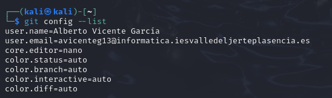
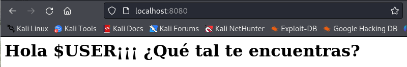

# PPS-Unidad0Actividad4-albertoVG

Vamos a hacer una nueva actividad con git. En esta ocasión crearemos un pequeño proyecto de una página web que podremos visualizar creando un pequeño servidor con php.
Como en la actividad anterior el producto a realizar será el repositorio en github. Allí tendrás que documentar la realización de la práctica con la explicación del procedimiento, sus imágenes, etc.

## Seguimos configurando Git

Ya habrás configurado tu email y tu user con git config. Vamos a configurar algunas cosas más.

1. Configura el editor de comandos. Yo por simplicidad utilizaría nano ``git config — global core.editor nano``
1. Comprueba qué valor tienen las variables de configuración de git. Puedes utilizar la ayuda ``git config --help``.
1. Ajusta los valores de las  variables de Git:

~~~
color.status=auto
color.branch=auto
color.interactive=auto
color.diff=auto
~~~ 

## Creación de Proyecto y repositorio

Para ello crea una nueva carpeta en tu directorio de git de PPS, con el nombre de esta actividad ___PPS-Unidad0Actividad4-albertoVG___

Creo un nuevo repositorio público con nombre **PPS-Unidad0Actividad4-albertoVG** 

Sigue las indicaciones de github para crear tu nuevo repositorio en linea de comandos, esto es:

Viene a ser como esto, pero cambiando el nombre de usuario y de repositorio:

~~~
echo "# PPS-Unidad0Actividad4-albertoVG-> README.md
git init
git add README.md
git commit -m "first commit"
git branch -M main
git remote add origin git@github.com:vjp-raulAP/PPSActividad4Unidad0RaulAlbalatPerez-.git
git push -u origin main
~~~

---
## Iniciando Proyecto 

1. Haz un listado en forma de arbol (tree -a) de todos los archivos del directorio.
	+ En la imagen aparece un listado de las carpetas creadas y las ramas creadas
  

2. Crea un archivo con nombre** README** (si no existe todavía) y lo añades al proyecto.
  
 

3. Comprueba el estado de git (`git status -s` o `git status --short``. 

  

4. Escribe en él una descripción de la actividad y vuelves a comprobar su estado.

## Ignorando archivos

1. Crea una carpeta con nombre** Excluded**. En ella vamos a colocar la documentación que no queremos que sea rastreada y subida al repositorio.
+ Creo la carpeta **Excluded** dentro del fichero del repositorio de la práctica
 

2. Para comprobar que funciona crea algún archivo vacío allí y también crea un archivo con nombre excluido.txt en el directorio principal del repositorio.

3. Crea un archivo con nombre **.gitignore** en el cual vamos a poner los archivos y directorios que no queremos que se rastreen.

4. Indica en el** .gitignore** que los archivos con extensión** .txt** y el directorio **Excluded** no deben de ser rastreados ni sincronizados..
+ En gitignore se encontrará los archivos de textos que no se verán 

5. Comprueba el estado del proyecto y comprueba que no nos indica nada del seguimiento de dichos archivos.

## Trabajo con Git

1. Crea un archivo con nombre index.html. 
Dentro de nuestro directorio de practica 4 nos creamos el archivo `touch index.html`.

3. Introduce el código html para que nos muestre un mensaje de Hola mundo con tu nombre. Uno sencillo sería este:
~~~
   <H1>Hola $USER¡¡¡ ¿Qué tal te encuentras?</H1>
~~~   

3. Visualiza el estado del proyecto ( puedes hacer tambien un git status corto ``git status --s` o `git status --short``). 

4. Puedes ver como te indica que tienes varias operaciones por hacer: git add, git commit...

5. Añade el archivo index.html al proyecto (git add).
6. Haz un commit (Puedes hacer ``commit -am "commentario del commit"` de esta manera se añaden las modificaciones de archivos y se hace el commit con el mensaje indicado sin abrir el archivo y tener que escribir nosotros).

7. Vuelve a comprobar el estado del proyecto. Puedes ver como ya debería de estar todo en orden.

8. Vuelve a subir los cambios a tu repositorio de github (git push)

## Creación de nuestro servidor web y visualización de nuestro proyecto

1. En un nueva pestaña de terminal y en el mismo directorio, ejecuta php -S 0:8080 para lanzar un servidor con la página html que has creado.

2. Visualiza la página creada Puedes acceder a ella en tu navegador en el puerto 8080 de tu equipo: 

## Seguimos Trabajando con Git

1. Haz una copia del archivo local** index.html** con el nombre** index.html.save.** Modifica el fichero index.html para que cambie el texto mostrado en la página web.

 

2. Verifica estado del proyecto.

 

+ Esto indica que index.html.save es un archivo nuevo no añadido al control de versiones.

3. Comprueba las diferencias de los archivos que no han sido añadidos (``git diff``)

+ Si index.html.save es idéntico a index.html, no verás diferencias. Si introduces cambios en index.html.save, este comando te mostrará los cambios.

4. Refresca navegador para comprobar que ha cambiado el contenido de nuestra página web.
 

5.  Vuelve a la versión anterior del archivo index.html (git restore).
 

6. Vuelve a refrescar navegador para ver como vuelve a versión inicial.

7. Vamos a utiliza el comando ``git mv``. Elimina el archivo index.html y después de hacer un commit, mueve el archivo con index.html.save a index.html
Eliminar index.html (aunque en realidad no es necesario eliminarlo antes de renombrarlo, Git lo maneja automáticamente cuando usamos git mv)

 

Renombra index.html.save a index.html con el comando git mv:

 

8. Mira el estado del proyecto y confirma todos los cambios.

9. Para pull y push, haz un push y comprueba cómo han subido los archivos a github.com.

10.  Modifica el archivo index.php desde la página de github.com y haz un pull y comprueba cómo se ha modificado la página web en nuestro navegador.

hacemos un pull con los cambios realizados en github y los guardamos.

comprobamos que se han modificado los cambios

 

## Git log
1. Mira la página de (Git Book sobre los comandos git log)[https://git-scm.com/book/es/v2/Fundamentos-de-Git-Ver-el-Historial-de-Confirmaciones]
2. Muestra los logs 

+ Para ver los log de todos los commit usamos git log
 

3. Muestra los logs de los últimos 3 commits

 

4. Muestra los logs utilizando el modificador ``--pretty`
--pretty: Si quieres ver los logs en un formato más amigable que muestre solo los mensajes de commit, puedes usar --pretty con el formato "%h %s %cr" que muestra el hash corto del commit, el mensaje del commit y la fecha de cambio:

5. Muestra los logs de los últimos 2 commits donde se vean las diferencias de cada una de las entradas.
Este comando te mostrará una lista de archivos modificados junto con los nombres de los archivos y el estado de los cambios.

 

6. Muestra los logs de las modificaciones realizadas en el último día
+ Esto te mostrará los commits que ocurrieron dentro del último día desde la fecha actual.
 

## Ramas

1. Lista las ramas existentes.
+ Para listar las ramas existentes usamos git branch
 
 

2. Crea una nueva rama con nombre Vers1 a partir de la rama actual.

+ Para crear una nueva rama llamada Vers1 desde la rama actual y cambiar a esa nueva rama, utilizamos: git checkout -b Vers1

Este comando:
   +  Crea una nueva rama llamada Vers1.
   +  Te cambia automáticamente a la nueva rama Vers1

3. Haz una modificación del index.html y guardas modificaciones.
+ Hacemos la modificación del index.html

+ Y hacemos un git status para verificar el estado de los cambios

+ Hacemos un git add y un commit para guardar los cambios

 

4. Sube los cambios al respositorio remoto a la rama Vers1 `git push origin Vers1` (En este caso podemos ver cómo el index.html de la rama `m̀ain` y `Vers1` son diferentes.
+ Subimos los cambios a la rama remota Vers1 usando el siguiente comando:git push origin Vers1

 

## Entrega

Una vez documentado todo el proceso en tu README.md, en la entrega por la plataforma, pega el enlace a tu repositorio de github.com
